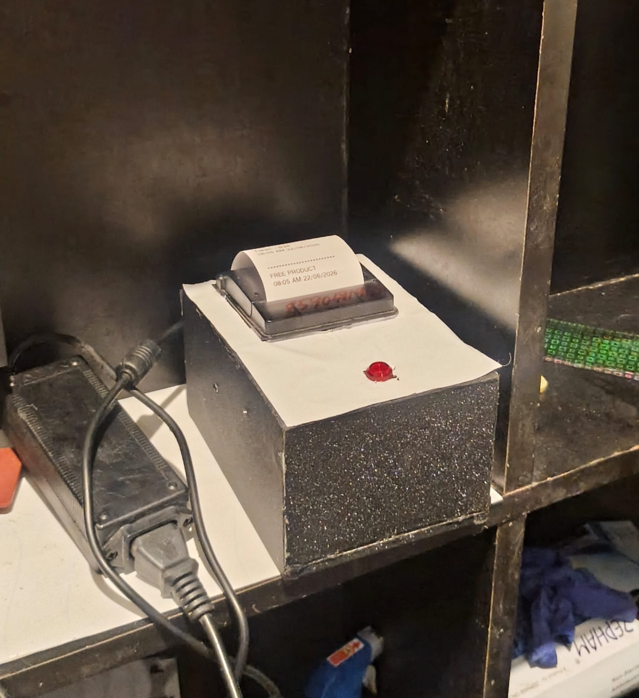

#  Embedded Thermal Printing Automation System


An embedded automation system built using **Raspberry Pi 4**, **Arduino Nano**, and **Python** to automate thermal printing through a **Telegram Bot**. The system enables remote print requests, printer status monitoring, GPIO-based hardware control, and reliable embedded automation.

---

##  Project Preview

### Prototype



### Telegram Bot


### Wiring Setup


### Thermal Printer Output


---

#  Overview

This project combines embedded hardware and software to create a wireless thermal printing system capable of receiving print commands remotely and controlling peripherals through GPIO.

The system was developed using Raspberry Pi, Arduino Nano, Python, and Linux, making it suitable for queue management, receipt printing, visitor management, and industrial automation applications.

---

#  Features

- Wireless printing using Telegram Bot
- Raspberry Pi and Arduino communication
- GPIO-based hardware control
- Thermal printer integration
- Printer status monitoring
- Push button controls
- RGB LED status indication
- Passive buzzer alerts
- Automatic print queue management
- Linux system service support

---

#  Hardware Components

| Component | Description |
|-----------|-------------|
| Raspberry Pi 4 | Main Controller |
| Arduino Nano | GPIO & Hardware Control |
| 58mm Thermal Printer | Receipt Printing |
| Relay Module | Device Switching |
| Push Buttons | User Controls |
| RGB LEDs | Status Indicators |
| Passive Buzzer | Audio Alerts |
| USB Cable | Printer Communication |
| 5V Power Supply | System Power |

---

#  Software Stack

- Python
- Arduino IDE
- Raspberry Pi OS
- python-telegram-bot
- python-escpos
- GPIO Zero
- Linux Systemd

---

#  System Architecture

```text
Telegram User
      │
      ▼
Telegram Bot
      │
      ▼
Raspberry Pi 4
      │
 ┌────┴─────┐
 │          │
 ▼          ▼
Arduino   Thermal Printer
 │
 ▼
Relay • LEDs • Buttons • Buzzer
```

---

#  Working Principle

1. User sends a print request through Telegram.
2. Raspberry Pi receives the command.
3. Python processes the incoming message.
4. Data is formatted for the thermal printer.
5. Printer receives the print job via USB.
6. Arduino manages GPIO peripherals including LEDs, relay, and buzzer.
7. Printer status is monitored continuously.
8. Notifications are generated if the printer encounters an error.

---

#  Repository Structure

```text
Embedded-Thermal-Printing-System/
│
├── Arduino/
├── RaspberryPi/
├── Hardware/
├── Images/
├── Documentation/
├── Results/
└── README.md
```

---

#  Applications

- Queue Token Printing
- Hospital Token System
- Visitor Management
- Restaurant Order Printing
- POS Receipt Printing
- Industrial Automation
- Service Center Token Printing

---

#  Skills Demonstrated

- Embedded Systems
- Raspberry Pi
- Arduino Nano
- Python Programming
- Linux Administration
- GPIO Programming
- Hardware Integration
- Embedded Automation
- Thermal Printer Integration
- Serial Communication
- Hardware Debugging
- System Testing

---

#  Future Improvements

- Web Dashboard
- QR Code Printing
- Cloud Printing
- Mobile App Integration
- OTA Firmware Updates
- Multi-Printer Support
- Print History Database

---


#  Author

**Anand S**

B.Tech – Mechatronics Engineering

📍 Thiruvananthapuram, Kerala

GitHub: https://github.com/anandcar730-svg

LinkedIn: https://linkedin.com/in/anand-s-63994925

---

